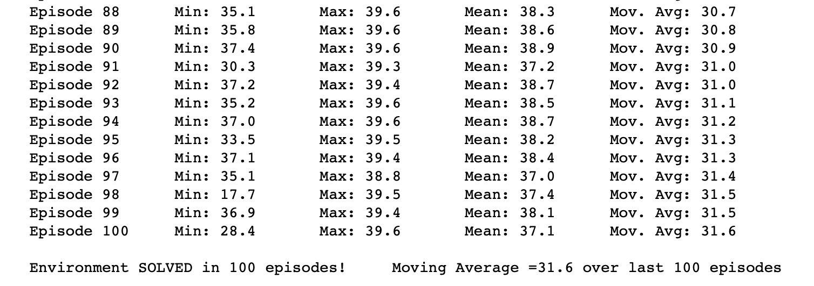
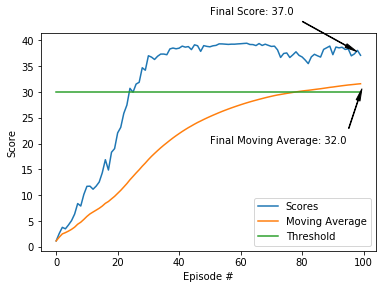

### Udacity Deep Reinforcement Learning Nanodegree
## Project 2: Continous Control
# Train Robotic Arms
-----------------------


Photo credit: [Google AI Blog](https://ai.googleblog.com/2018/06/scalable-deep-reinforcement-learning.html)


# Background
------------
Reinforcement learning is an area of Machine Learning that trains **AGENTS** to perform **ACTIONS** on an **ENVIRONMENT**, based on the action performance, the agent would receive a **REWARD** and the agents objective is to maximize **CUMULATIVE FUTURE REWARDS**.

Agents in general can be aware of the environment and task in advance, or simply the agents can start training without having information on the environment and the task, and let the reward system guide them to find the **OPTIMUM POLICY** leading to maximum future rewards for the given task.

Reinforcement Learning agents adaption is becoming more popular specially with the emergence of project like:

- [Self-Driving Cars](https://arxiv.org/pdf/1811.11329.pdf)
- [Autnomous Drones](https://arxiv.org/pdf/1801.05086.pdf)
- [Traffic Light Control](https://towardsdatascience.com/applications-of-reinforcement-learning-in-real-world-1a94955bcd12)
- [Industrial Robots](https://www.sciencedirect.com/science/article/pii/S221282711730241X)

And many other applications.

Compared to traditional control systems, Reinforcement Learning agents outperform traditional control systems, when the environment and actions become more complex, where [research showed](https://arxiv.org/pdf/1902.07903.pdf) that for example, in power control for cellular networks, reinfrocement agents outperformed traditional methods in terms of power efficiency by **15%**.

# Objective
---------------------------

Objective of this assignment is to train a reinforcement learning agent using [DDPG algorith](https://arxiv.org/pdf/1509.02971.pdf). DDPG is a model free algorithm, in other words, the agent is not aware of the model of the environment. In other words, the agent does not know the transition probability from one state to another.

The agent is trained used to control a robotic arm, using Unity's Reacher environment. The goal, is to get 20 different agents to maintain contact with the moving green balls.

Every step the agent touches the ball, it receives a reward of +0.1, otherwise a reward of 0 is received. For the task to be solved, the agents have to receive a score of 30 averaged over all agents for the past 100 episodes.


# Environment
-------------
- Robotic Arm: Double-jointed arm
- State (observation) space: 33 variables corresponding to position, rotation, velocity, and angular velocities of the 2 joints
- Action space: Vector of 4 continous numbers between -1 and 1, corresponding to torque applicable to two joints
- Objective: Mean rewards of 20 agents across 100 consecutive episodes of 30

# Getting Started
--------
## Activate the environment:
If you haven't already, please follow the [instructions in the DRLND GitHub repository](https://github.com/udacity/deep-reinforcement-learning#dependencies) to set up your Python environment. These instructions can be found in README.md at the root of the repository. By following these instructions, you will install PyTorch, the ML-Agents toolkit, and a few more Python packages required to complete the project.

(For Windows users) The ML-Agents toolkit supports Windows 10. While it might be possible to run the ML-Agents toolkit using other versions of Windows, it has not been tested on other versions. Furthermore, the ML-Agents toolkit has not been tested on a Windows VM such as Bootcamp or Parallels.

## Download the Unity Environment
The repo already includes the environment for [20 agents for OSX](./Reacher.many). For different operating systems, please follow the links below:

- Linux: [click here](https://s3-us-west-1.amazonaws.com/udacity-drlnd/P2/Reacher/Reacher_Linux.zip)
- Mac OSX: [click here](https://s3-us-west-1.amazonaws.com/udacity-drlnd/P2/Reacher/Reacher.app.zip)
- Windows (32-bit): [click here](https://s3-us-west-1.amazonaws.com/udacity-drlnd/P2/Reacher/Reacher_Windows_x86.zip)
- Windows (64-bit): [click here](https://s3-us-west-1.amazonaws.com/udacity-drlnd/P2/Reacher/Reacher_Windows_x86_64.zip)

In case you download the environment, replace the existing environment in the repo, with the downloaded one.

## Instructions

Follow the instructions in [Continuous_Control.many.ipynb](./Continuous_Control.many.ipynb) to get started with training your own agent!

### Folders:
- classes: This is where the agent and the pytorch models are defined, it consists of the following classes:
    - agents: DDPG based Agent
    - memory: Replay buffer
    - models: Actor/Critic definitions
    - noise: Ornstein–Uhlenbeck process based noise
- models: Trained models
    - actor_ckpt.pth
    - critic_ckpt.pth

### File: Continuous_Control.many.ipynb

Training and presentation of results for DDPG based agent

# Results


- The agent achieved the target in 100 episodes as displayed above


- The agent stop improving after around the 40th episode

# Discusssion
- Introduction of Prioterized Experience Replay to improve the learning
- Introduction of early stop of learning, to accelerate the learning, where if learning was stopped after 40th episode + evaluation buffer lenght. 


```python

```
